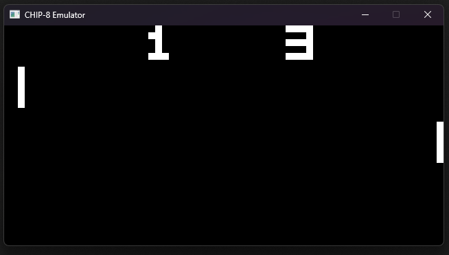

# CHIP-8 Emulator

CHIP-8 Emulator written in C.\
Fully functional except for sound.

## Screenshots

## References
https://tobiasvl.github.io/blog/write-a-chip-8-emulator/

https://en.wikipedia.org/wiki/CHIP-8